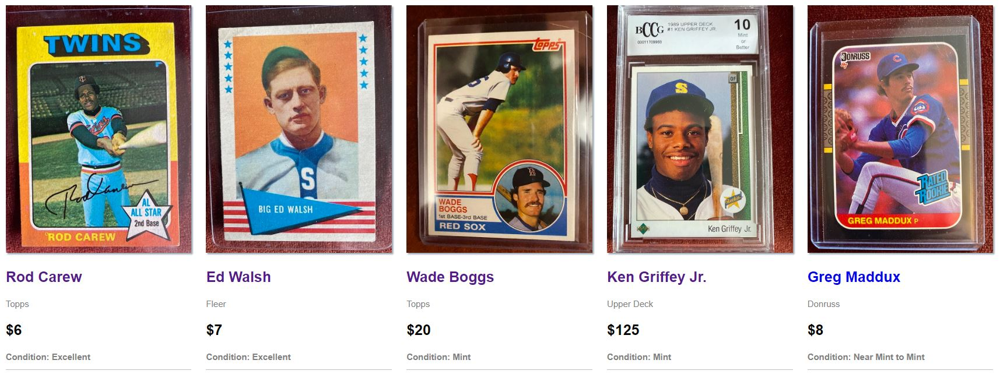

### Welcome to Fritze Cards 👋
### Live Version: https://fritze-cards.herokuapp.com/
###
###

  

# Fritze Cards

Fritze Cards is an Ecommerce application for purchasing baseball cards from my personal collection.

## Installation

- Clone Repo
- Install MongoDB
- npm install
#
- create .env file

#### MONGODB_URL=mongodb://localhost/your mongoDB db-name here
#### JWT_SECRET=secret
#### PAYPAL_CLIENT_ID=your dev paypal ID goes here
#
- npm start ('jayrow' root directory) - backend
- npm start ('frontend' directory) - frontend

## Technology - MERN Stack

- MongoDB
- Express
- React
- Node
- Redux
- Mongoose
- Axios
- Babel
- Nodemon
- Paypal (sandbox environment)

## License
[MIT](https://choosealicense.com/licenses/mit/)

